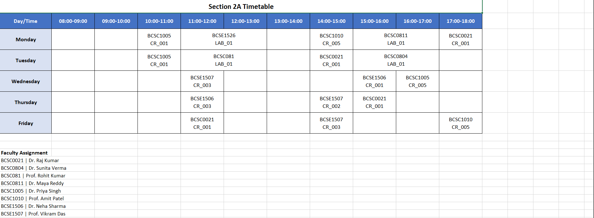
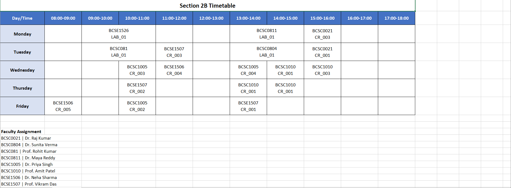

# Timetable Management System Backend

Welcome to the backend core of the Timetable Management System. This repository contains the data models, scheduling engine, and validation logic required to generate conflict-free college timetables.

## 🛠️ Work Completed (Issues 1-4)

### 1. Core Data Models (Issue 1)
We established a robust database foundation using **PostgreSQL (Neon)** and **SQLAlchemy**.
- **Schema**: Defined models for `Faculty`, `Course`, `Section`, `Room`, `Timeslot`, and `Assignment`.
- **Snapshots**: Implemented `TimetableVersion` to save immutable snapshots of generated timetables.
- **Connection**: Fully verified database connectivity and table auto-creation.

### 2. Validation Engine / Solver (Issue 2)
The "Brain" of the system, powered by **Google OR-Tools CP-SAT**.
- **Conflict Logic**: Guaranteed zero overlaps for Teachers, Rooms, and Student Sections.
- **Hard Constraints**: Enforced room type matching (e.g., Labs only in Lab rooms) and faculty availability.
- **Fallback Solver**: Developed a "Pure Python" solver to ensure the system works even if native C++ libraries are missing on the host machine.

### 3. Input Contracts (Issue 3)
Defined the "Law of the System"—the exact format for data uploads.
- **Dual-Shift Support**: Configured two distinct shifts:
  - **Morning**: 08:00 - 16:00 (Lunch: 12:00 - 13:00)
  - **Evening**: 10:00 - 18:00 (Lunch: 13:00 - 14:00)
- **Frozen Schemas**: Created official CSV templates for Faculty, Rooms, Courses, Sections, and Mappings.

### 4. Input Validation Logic (Issue 4)
The "Gatekeeper" service that stops bad data from reaching the solver.
- **Structure**: Checks for missing headers or empty mandatory fields.
- **Reference**: Ensures sections point to courses that actually exist.
- **Logic**: Detects impossible schedules (e.g., 5 labs requested but 0 lab rooms provided).

---

## 📊 Sample Outputs

### Example 1: Successful Timetable Generation
When the solver runs successfully, it produces a structured assignment list:
```json
{
  "version_id": 1,
  "status": "FEASIBLE",
  "assignments": [
    {
      "section": "CS-2024-A",
      "faculty": "Dr. Smith",
      "room": "Room-101",
      "timeslot": "Monday 09:00 - 10:00"
    },
    {
      "section": "ME-2024-B",
      "faculty": "Prof. Jones",
      "room": "Workshop-2",
      "timeslot": "Monday 10:00 - 11:00"
    }
  ]
}
```

### Example 2: Validation Error Report
If a user uploads a broken CSV, the **ValidatorService** outputs clear instructions:
```json
{
  "is_valid": false,
  "errors": [
    "File 'faculty.csv' is missing mandatory column: 'email'",
    "Section 'SEC-01' refers to unknown course code: 'MATH999'"
  ],
  "warnings": [
    "Room 'Seminar-Hall' is registered but has no sessions assigned."
  ]
}
```

---

## 🚀 Getting Started
1. **Environment**: Ensure you are using Python 3.11+.
2. **Setup**: Run `pip install -r requirements.txt`.
3. **Database**: Configure `DATABASE_URL` in your `.env` file.
4. **Test**: Run `python tests/test_solver_logic.py` to verify the engine.

## ⚙️ CLI Scripts (ingest → generate → export)
Run the pipeline in four steps after preparing your CSVs in `backend/rawData/`:

1. Put your input CSV files into `backend/rawData/`.
2. Import and normalize the data:

```bash
python backend/scripts/import_pipeline.py rawData/
```

3. Generate a timetable (uses the normalized DB data):

```bash
python backend/scripts/generate.py
```

4. Export a timetable version to Excel (post-processes LAB merges):

```bash
python backend/scripts/export.py 1
```
---
# Output generated on the testing data




Notes:
- The Excel exporter implementation is at `backend/app/services/excel_exporter.py`.
- `export.py` post-processes the workbook to merge adjacent LAB cells (two-hour labs).
- Ensure your `.env` has `DATABASE_URL` and your virtualenv is activated before running scripts.
