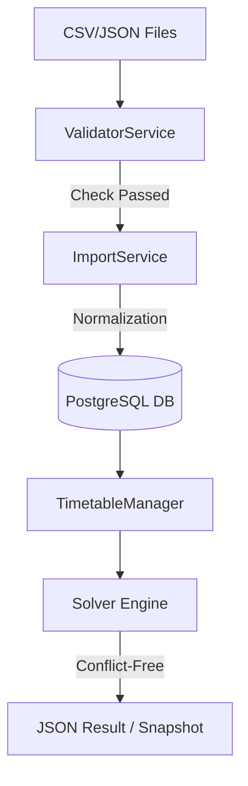

# How It Works

This document explains exactly how data flows through the backend to achieve our goal of generating a conflict-free timetable.

## 🔄 The Correct Workflow
Your understanding was close, but the **Database** actually acts as the "Storage" between the input and the solver. Here is the actual path:

### Stage 1: The Input (Ingestion)
1. **Raw Files**: Data starts as CSV/JSON files (located in `data_templates` or uploaded).
2. **Validation (`ValidatorService`)**: First, we check if the files are broken. We catch errors **before** they even touch our logic.
3. **Normalization (`ImportService`)**: This is where we clean the "Human" mess (extra spaces, typos, mixed casing).
4. **Persistence (PostgreSQL)**: The cleaned, normalized data is saved into your database.

### Stage 2: The Output (Generation)
5. **Data Retrieval**: The `generate_v1.py` script (via the `TimetableManager`) pulls the **cleaned** data *out* of the database.
6. **The Solver (`SolverService`)**: The Manager hands this data to the OR-Tools solver. Because the data was normalized in Stage 1, the solver sees perfect, unambiguous IDs.
7. **JSON Output**: The solver calculates the schedule and returns a structured JSON "Snapshot" which is saved as a `TimetableVersion`.

---

## 🗺️ Visual Flow


---

## 📊 Sample Workflow Output
When you run the pipeline, you will see this transformation:

**1. Messy Input (CSV):**
`"  dr. smith ", cs101`

**2. Normalization Log:**
`• [Faculty] Trimming '  dr. smith ' -> 'dr. smith' (Email: SMITH@UNI.EDU)`

**3. Solver Output (JSON):**
```json
{
  "version": 1,
  "status": "FEASIBLE",
  "assignments": [
    {
      "faculty": "dr. smith",
      "course": "CS101",
      "room": "Room-101",
      "slot": "Monday 09:00"
    }
  ]
}
```

---

## 💡 Key Concept
The **Database** is our "Source of Truth." We never allow "Dirty" data into the database. By the time the Solver runs, it is working with the highest quality data possible.
